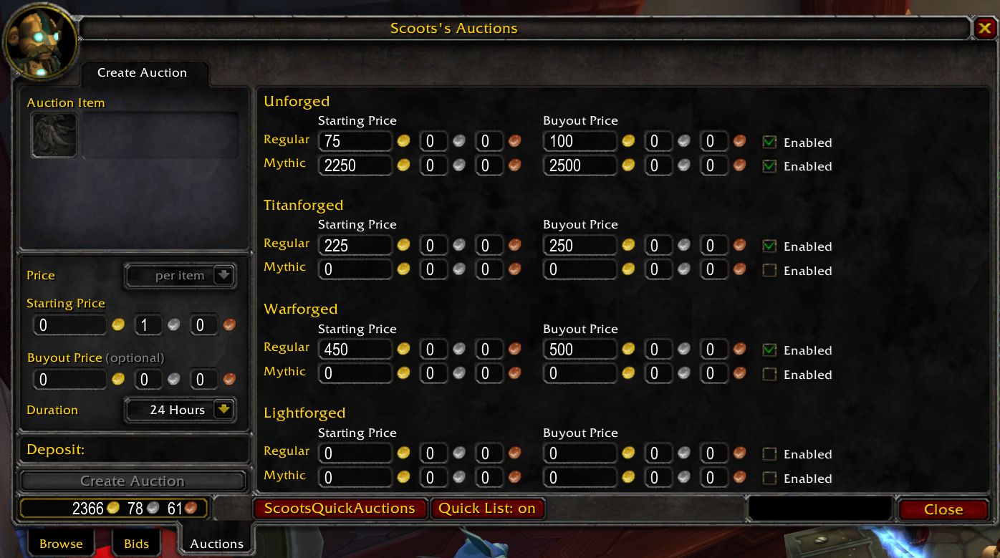
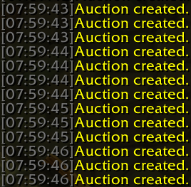

## Description ##

This allows you to specify a price, and then rapidly create auctions at that price just by right-clicking on items in your inventory when the Auctions tab of the auction house is active.

## Installation ##

Download this repository, then extract the `ScootsQuickAuction` subdirectory from the `src` directory into your `World of Warcraft/Interface/AddOns` directory.

## Screenshots ##

## Support ##

If you'd like to show support for my addons you can use the button below.

Please do not feel obligated to do so - especially if you are not in a financially secure position - and please don't give beyond your means.

